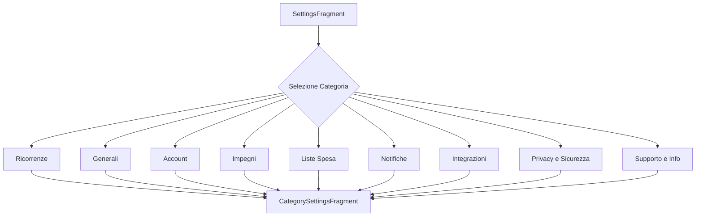

# Settings

## Sommario
- [Introduzione](#introduzione)
- [Contenuto](#contenuto)
- [Conclusione](#conclusione)

## Introduzione
Introduzione al documento Settings.

## Contenuto
# SettingsFragment

## Panoramica
`SettingsFragment` è il componente principale per la gestione delle impostazioni nell'applicazione SantiBailor. Gestisce la visualizzazione e la navigazione verso varie categorie di impostazioni, offrendo un'interfaccia utente intuitiva per la configurazione dell'app.

## Struttura e Organizzazione del Codice
La classe `SettingsFragment` è situata nel package `it.faustobe.santibailor.presentation.features.settings`. Estende `Fragment` e utilizza View Binding per l'interazione con il layout.

## Funzionalità Principali
1. Visualizzazione delle principali categorie di impostazioni
2. Navigazione verso sottosezioni specifiche di impostazioni
3. Gestione del pulsante "Back" personalizzata
4. Configurazione della toolbar e del menu

## Dettagli Implementativi

### Metodi Principali

#### `onCreateView()`
Inizializza il binding del layout.

#### `onViewCreated()`
Configura la toolbar, imposta i listener e configura il menu.

```java
@Override
public void onViewCreated(@NonNull View view, Bundle savedInstanceState) {
    super.onViewCreated(view, savedInstanceState);
    setupToolbar();
    setupListeners();
    setupMenu();
}
```

#### `setupListeners()`
Configura i listener per i pulsanti delle varie categorie di impostazioni.

#### `navigateToCategorySettings()`
Gestisce la navigazione verso le sottosezioni di impostazioni utilizzando Safe Args.

```java
private void navigateToCategorySettings(String categoryTitle, SettingItem[] settingItems) {
    try {
        SettingsFragmentDirections.ActionSettingsFragmentToCategorySettingsFragment action =
                SettingsFragmentDirections.actionSettingsFragmentToCategorySettingsFragment(
                        categoryTitle,
                        settingItems
                );
        Navigation.findNavController(requireView()).navigate(action);
    } catch (Exception e) {
        Log.e("SettingsFragment", "Errore nella navigazione con Safe Args: " + e.getMessage());
        navigateToCategorySettingsFallback(categoryTitle, settingItems);
    }
}
```

### Categorie di Impostazioni
- Ricorrenze
- Generali
- Account
- Impegni
- Liste Spesa
- Notifiche
- Integrazioni
- Privacy e Sicurezza
- Supporto e Informazioni

### Pattern di Progettazione Utilizzati
- **Fragment Pattern**: Utilizzo di Fragment per la gestione modulare dell'UI.
- **View Binding**: Per un accesso type-safe alle view del layout.
- **Navigation Component**: Per gestire la navigazione tra le sezioni delle impostazioni.

## Best Practices e Considerazioni
- Utilizzo di Safe Args per una navigazione type-safe.
- Implementazione di un fallback per la navigazione in caso di errori.
- Separazione delle responsabilità per ogni categoria di impostazioni.
- Gestione personalizzata del pulsante "Back" per migliorare l'esperienza utente.

## Interazioni con Altri Componenti
- **Navigation Component**: Per la navigazione tra i fragment.
- **CategorySettingsFragment**: Destinazione per le sottosezioni di impostazioni.
- **ActionBar**: Per la configurazione della toolbar.

## Esempi di Codice
Esempio di configurazione di una categoria di impostazioni:

```java
private void navigateToRicorrenzeSettings() {
    List<SettingItem> ricorrenzeSettings = new ArrayList<>();
    ricorrenzeSettings.add(new SettingItem("Gestione Ricorrenze", "Aggiungi, modifica o elimina ricorrenze", R.id.action_categorySettingsFragment_to_manageRicorrenzeFragment));
    ricorrenzeSettings.add(new SettingItem("Notifiche Ricorrenze", "Attiva o disattiva le notifiche", true));
    ricorrenzeSettings.add(new SettingItem("Sincronizzazione calendario", "Sincronizza con calendari esterni"));

    SettingItem[] settingItemsArray = ricorrenzeSettings.toArray(new SettingItem[0]);

    navigateToCategorySettings("Impostazioni Ricorrenze", settingItemsArray);
}
```

## Diagramma di Flusso


```
## Note sulla Testabilità
- Implementare test unitari per verificare la corretta creazione delle liste di impostazioni per ogni categoria.
- Utilizzare Espresso per i test UI, verificando la corretta visualizzazione delle categorie e la navigazione.
- Mockare il NavController per testare la logica di navigazione.

## Considerazioni Future
1. Implementare un sistema di ricerca all'interno delle impostazioni per una navigazione più rapida.
2. Considerare l'aggiunta di un sistema di preferenze per salvare le impostazioni dell'utente.
3. Implementare una funzionalità di esportazione/importazione delle impostazioni.
4. Aggiungere supporto per temi dinamici nelle impostazioni dell'app.
5. Implementare un sistema di suggerimenti contestuali per guidare l'utente attraverso le impostazioni più importanti.

## Conclusione
Conclusione del documento Settings.

---
Per ulteriori informazioni, consultare la [documentazione principale](../README.md).
