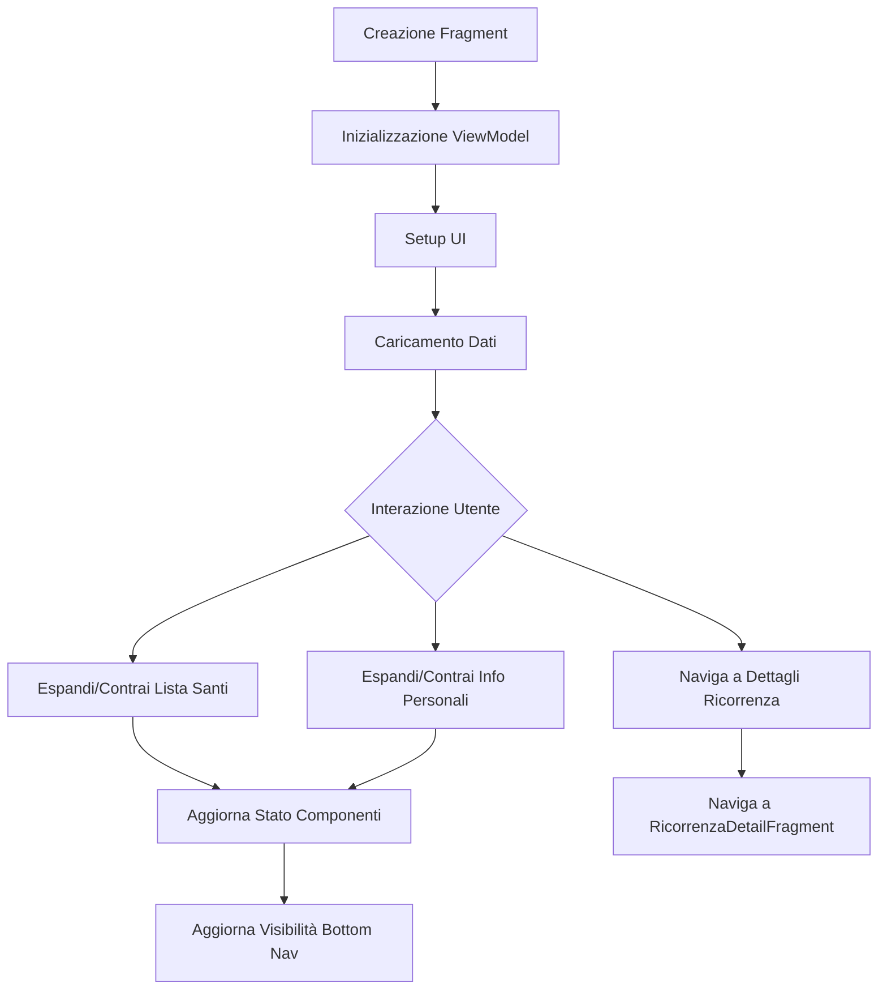

# Home Fragment

## Sommario
- [Introduzione](#introduzione)
- [Contenuto](#contenuto)
- [Conclusione](#conclusione)

## Introduzione
Introduzione al documento Home Fragment.

## Contenuto
# HomeFragment

## Panoramica
`HomeFragment` è il fragment principale dell'applicazione SantiBailor. Gestisce la visualizzazione della schermata home, che include la data corrente, il santo del giorno, una lista di santi, informazioni personali e una to-do list.

## Struttura e Organizzazione del Codice
La classe `HomeFragment` è situata nel package `it.faustobe.santibailor.presentation.features.home`. Estende `Fragment` e utilizza Hilt per la dependency injection.

## Funzionalità Principali
1. Visualizzazione della data corrente
2. Visualizzazione del santo del giorno
3. Gestione di una lista espandibile di santi
4. Visualizzazione e gestione di informazioni personali espandibili
5. Integrazione con `RicorrenzaViewModel` per la gestione dei dati
6. Navigazione verso i dettagli delle ricorrenze
7. Gestione della scrolling e visibilità del bottom navigation menu

## Dettagli Implementativi

### Classi e Interfacce Chiave
- `HomeFragment`: La classe principale del fragment
- `FragmentHomeBinding`: Classe di binding generata per il layout del fragment
- `RicorrenzaViewModel`: ViewModel per la gestione dei dati delle ricorrenze
- `HomeViewModel`: ViewModel specifico per la gestione dello stato della home
- `RicorrenzaAdapter`: Adapter per la lista dei santi

### Metodi Principali

#### `onCreateView()`
Inizializza il binding del layout.

#### `onViewCreated()`
Configura l'UI, inizializza i ViewModel e imposta i listener.

```java
@Override
public void onViewCreated(@NonNull View view, @Nullable Bundle savedInstanceState) {
    super.onViewCreated(view, savedInstanceState);
    ricorrenzaViewModel = new ViewModelProvider(requireActivity()).get(RicorrenzaViewModel.class);
    // ... (altre inizializzazioni)
    setupDateDisplay();
    loadBackgroundImage();
    setupSaintOfDay();
    setupPersonalInfo();
    setupSaintsList();
    // ... (altre configurazioni)
}
```

#### `setupSaintsList()`
Configura la RecyclerView per la lista dei santi e imposta l'observer per i dati delle ricorrenze.

#### `toggleSaintsListExpansion()`
Gestisce l'espansione e la contrazione della lista dei santi.

#### `setupPersonalInfoCard()`
Configura la card delle informazioni personali e gestisce la sua espansione/contrazione.

### Pattern di Progettazione Utilizzati
- **MVVM**: Utilizzo di ViewModel per separare la logica di business dalla UI.
- **Observer Pattern**: Utilizzo di LiveData per osservare cambiamenti nei ViewModel.
- **Adapter Pattern**: Utilizzo di RicorrenzaAdapter per la lista dei santi.

## Best Practices e Considerazioni
- Utilizzo di ViewBinding per un accesso type-safe alle view.
- Separazione delle responsabilità tra UI (Fragment) e logica di business (ViewModel).
- Gestione efficiente degli stati di espansione/contrazione per migliorare l'UX.
- Implementazione di animazioni smooth per le transizioni di visibilità.

## Interazioni con Altri Componenti
- **RicorrenzaViewModel**: Fornisce dati sulle ricorrenze e gestisce le operazioni CRUD.
- **HomeViewModel**: Gestisce lo stato specifico della home (es. espansione dei componenti).
- **MainActivity**: Interagisce per la gestione della visibilità del bottom navigation menu.

## Esempi di Codice
Esempio di gestione dell'espansione della lista dei santi:

```java
private void toggleSaintsListExpansion() {
    isSaintsListExpanded = !isSaintsListExpanded;
    if (ricorrenzaAdapter != null) {
        ricorrenzaAdapter.setCollapsedView(!isSaintsListExpanded);
    }
    if (binding.recyclerViewSaints != null) {
        if (isSaintsListExpanded) {
            binding.recyclerViewSaints.setVisibility(View.VISIBLE);
            ObjectAnimator.ofFloat(binding.recyclerViewSaints, "alpha", 0f, 1f).start();
        } else {
            ObjectAnimator.ofFloat(binding.recyclerViewSaints, "alpha", 1f, 0f).setDuration(200).start();
            binding.recyclerViewSaints.postDelayed(() -> {
                binding.recyclerViewSaints.setVisibility(View.GONE);
                updateBottomMenuVisibility();
            }, 200);
        }
    }
    updateSaintsListIcon();
    updateComponentsState();
}
```

## Diagramma di Flusso


```
## Note sulla Testabilità
- Implementare test unitari per la logica di espansione/contrazione dei componenti.
- Utilizzare Espresso per i test UI, verificando la corretta visualizzazione e interazione con la lista dei santi e le informazioni personali.
- Mockare RicorrenzaViewModel per testare scenari con diversi set di dati.

## Considerazioni Future
1. Implementare la funzionalità di ricerca all'interno della lista dei santi.
2. Aggiungere supporto per la personalizzazione dell'ordine e della visibilità dei componenti nella home.
3. Implementare una cache locale per migliorare le prestazioni di caricamento dei dati.
4. Considerare l'aggiunta di animazioni più elaborate per migliorare l'esperienza utente durante le transizioni.
5. Implementare la funzionalità di pull-to-refresh per aggiornare manualmente i dati.

## Conclusione
Conclusione del documento Home Fragment.

---
Per ulteriori informazioni, consultare la [documentazione principale](../README.md).
