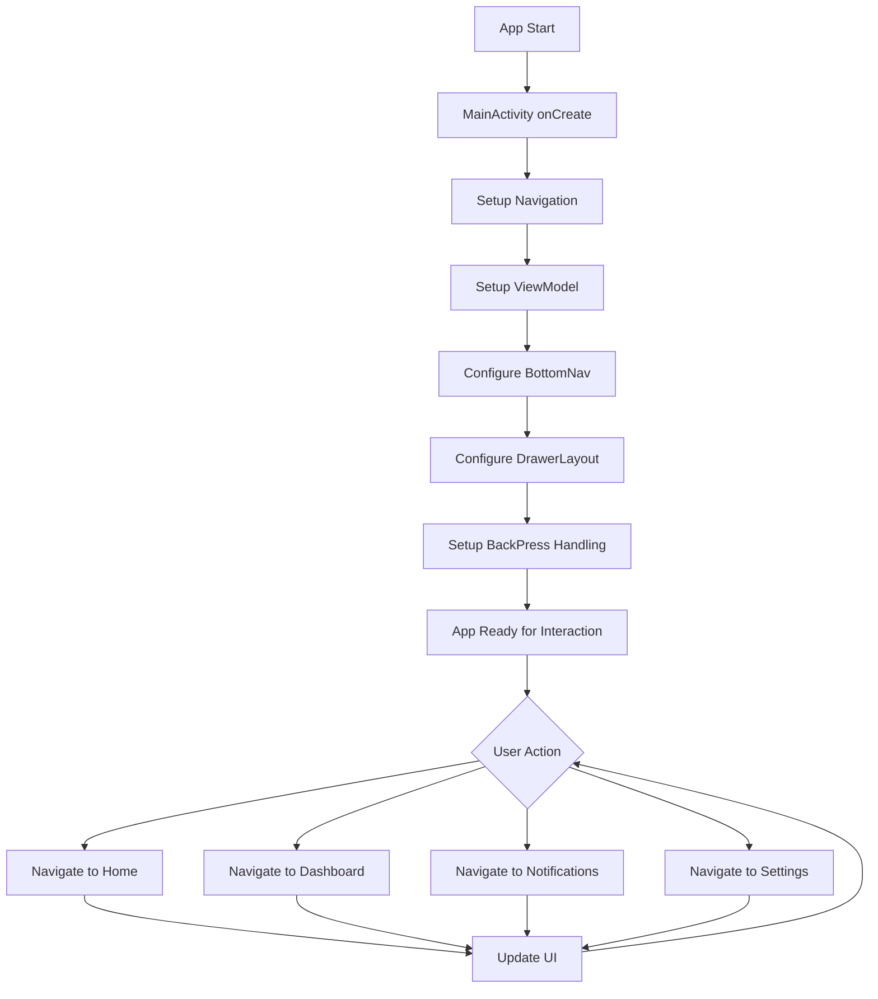

# Main Activity

## Sommario
- [Introduzione](#introduzione)
- [Contenuto](#contenuto)
- [Conclusione](#conclusione)

## Introduzione
Introduzione al documento Main Activity.

## Contenuto
# MainActivity

## Panoramica
`MainActivity` è l'activity principale dell'applicazione SantiBailor. Gestisce la navigazione primaria dell'app, inclusi il BottomNavigationView e il DrawerLayout, e coordina le interazioni tra i vari fragment.

## Struttura e Organizzazione del Codice
La classe `MainActivity` è situata nel package `it.faustobe.santibailor.presentation.features.main`. È annotata con `@AndroidEntryPoint`, indicando l'utilizzo di Hilt per la dependency injection.

## Funzionalità Principali
1. Inizializzazione e gestione della navigazione (BottomNavigationView e DrawerLayout)
2. Configurazione e gestione del NavController
3. Gestione dinamica della visibilità del BottomNavigationView
4. Implementazione del listener per NavigationView
5. Gestione del comportamento del pulsante "Back"
6. Coordinamento con HomeViewModel e RicorrenzaViewModel

## Dettagli Implementativi

### Classi e Interfacce Chiave
- `MainActivity`: La classe principale che estende `AppCompatActivity`
- `ActivityMainBinding`: Classe di binding generata per il layout dell'activity
- `HomeViewModel` e `RicorrenzaViewModel`: ViewModel utilizzati per la logica di business

### Metodi Principali

#### `onCreate(Bundle savedInstanceState)`
Inizializza l'activity, imposta il layout e configura la navigazione.

```java
@Override
protected void onCreate(Bundle savedInstanceState) {
    super.onCreate(savedInstanceState);
    // ... (inizializzazione del binding e dei ViewModel)
    setupNavigation();
    setupBackPressedDispatcher();
}
```

#### `setupNavigation()`
Configura il NavController, BottomNavigationView e DrawerLayout.

#### `onDestinationChanged(...)`
Gestisce i cambiamenti di destinazione nella navigazione, aggiornando l'UI di conseguenza.

#### `handleScroll()`
Gestisce la visibilità del BottomNavigationView durante lo scrolling.

### Pattern di Progettazione Utilizzati
- **MVVM**: Utilizzo di ViewModel per separare la logica di business dalla UI.
- **Observer Pattern**: Utilizzo di LiveData per osservare cambiamenti nei ViewModel.
- **Dependency Injection**: Utilizzo di Hilt per l'iniezione delle dipendenze.

## Best Practices e Considerazioni
- Utilizzo di ViewBinding per un accesso type-safe alle view.
- Implementazione di una logica di navigazione robusta con Navigation Component.
- Gestione efficiente della visibilità del BottomNavigationView per migliorare l'UX.
- Utilizzo di Hilt per la dependency injection, semplificando la gestione delle dipendenze.

## Interazioni con Altri Componenti
- **NavController**: Gestisce la navigazione tra i fragment.
- **HomeViewModel** e **RicorrenzaViewModel**: Forniscono dati e logica di business per l'UI.
- **BottomNavigationView** e **DrawerLayout**: Componenti UI per la navigazione.

## Esempi di Codice
Esempio di gestione della navigazione:

```java
private void setupNavigation() {
    NavHostFragment navHostFragment = (NavHostFragment) getSupportFragmentManager()
            .findFragmentById(R.id.nav_host_fragment);
    if (navHostFragment != null) {
        navController = navHostFragment.getNavController();
        BottomNavigationView navView = binding.bottomNavView;
        NavigationUI.setupWithNavController(navView, navController);
        // ... (configurazione aggiuntiva)
    }
}
```

## Diagramma di Flusso


```
## Note sulla Testabilità
- Utilizzare Espresso per i test UI della `MainActivity`.
- Creare test unitari per la logica di navigazione utilizzando un NavController mockato.
- Testare la gestione della visibilità del BottomNavigationView in vari scenari di navigazione.

## Considerazioni Future
1. Implementare una gestione più granulare delle animazioni di transizione tra fragment.
2. Considerare l'aggiunta di un sistema di deep linking per una navigazione più flessibile.
3. Ottimizzare ulteriormente la gestione dello stato salvato per una migliore esperienza durante le rotazioni del dispositivo.
4. Valutare l'implementazione di un sistema di analytics per tracciare i pattern di navigazione degli utenti.
5. Considerare l'aggiunta di supporto per temi dinamici o modalità scura.

## Conclusione
Conclusione del documento Main Activity.

---
Per ulteriori informazioni, consultare la [documentazione principale](../README.md).
