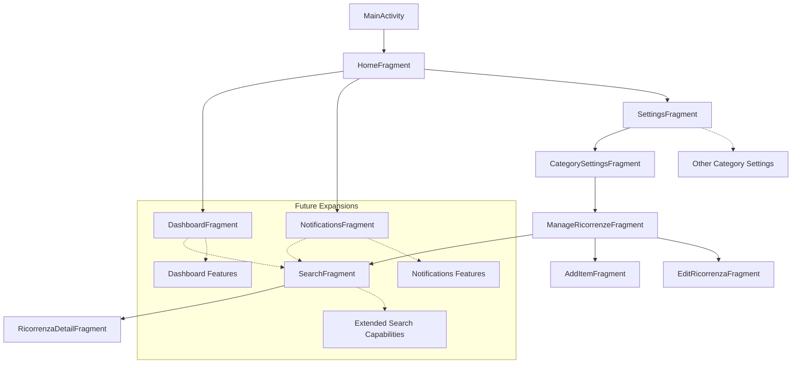

# Diagramma Flusso

## Sommario
- [Introduzione](#introduzione)
- [Contenuto](#contenuto)
- [Conclusione](#conclusione)

## Introduzione
Introduzione al documento Diagramma Flusso.

## Contenuto

## Conclusione
Conclusione del documento Diagramma Flusso.

---
Per ulteriori informazioni, consultare la [documentazione principale](../README.md).
