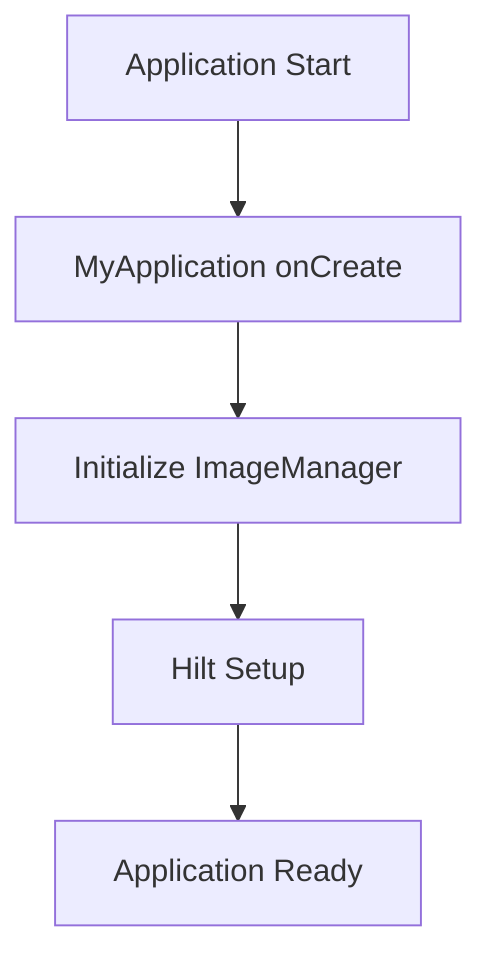

# My Application

## Sommario
- [Introduzione](#introduzione)
- [Contenuto](#contenuto)
- [Conclusione](#conclusione)

## Introduzione
Introduzione al documento My Application.

## Contenuto
# MyApplication

## Panoramica
`MyApplication` è la classe principale dell'applicazione SantiBailor, che estende `Application`. Questa classe è responsabile dell'inizializzazione dei componenti principali dell'app e della gestione delle risorse globali.

## Struttura e Organizzazione del Codice
La classe `MyApplication` è situata nel package root `it.faustobe.santibailor`. È annotata con `@HiltAndroidApp`, indicando l'utilizzo di Hilt per la dependency injection a livello di applicazione.

## Funzionalità Principali
1. Inizializzazione dell'applicazione
2. Gestione dell'ImageManager

## Dettagli Implementativi

### Classi e Interfacce Chiave
- `MyApplication`: La classe principale che estende `Application`
- `ImageManager`: Una classe utility per la gestione delle immagini

### Metodi Principali

#### `onCreate()`
Inizializza l'applicazione e crea un'istanza di `ImageManager`.

```java
@Override
public void onCreate() {
    super.onCreate();
    imageManager = new ImageManager(this);
}
```

#### `getImageManager()`
Fornisce accesso all'istanza di `ImageManager`.

```java
public ImageManager getImageManager() {
    return imageManager;
}
```

### Pattern di Progettazione Utilizzati
- **Singleton**: L'`ImageManager` è gestito come un singleton a livello di applicazione.

## Best Practices e Considerazioni
- Utilizzo di Hilt per la dependency injection, che semplifica la gestione delle dipendenze nell'app.
- Centralizzazione della gestione delle immagini attraverso `ImageManager`.

## Interazioni con Altri Componenti
- **ImageManager**: Gestito centralmente per essere accessibile da altre parti dell'applicazione.
- **Hilt**: Configurazione a livello di applicazione per la dependency injection.

## Esempi di Codice
Esempio di come accedere all'ImageManager da altre parti dell'applicazione:

```java
public class SomeActivity extends AppCompatActivity {
    private ImageManager imageManager;

    @Override
    protected void onCreate(Bundle savedInstanceState) {
        super.onCreate(savedInstanceState);
        imageManager = ((MyApplication) getApplication()).getImageManager();
        // Usa imageManager...
    }
}
```

## Diagramma di Flusso


```
## Note sulla Testabilità
- Utilizzare dependency injection per facilitare il mocking di `ImageManager` nei test.
- Creare un'implementazione di test per `MyApplication` che permetta di iniettare mock objects.

## Considerazioni Future
1. Valutare l'aggiunta di altre inizializzazioni globali (es. logging, crash reporting).
2. Considerare l'implementazione di un meccanismo di configurazione dell'applicazione.
3. Implementare un sistema di caching globale se necessario.
4. Valutare l'uso di un custom Application.ActivityLifecycleCallbacks per monitorare il ciclo di vita delle activities.

## Conclusione
Conclusione del documento My Application.

---
Per ulteriori informazioni, consultare la [documentazione principale](../README.md).
