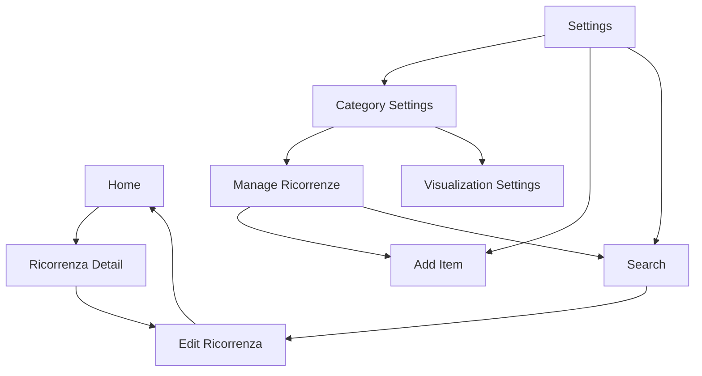

# Panoramica Navigazione

## Sommario
- [Introduzione](#introduzione)
- [Contenuto](#contenuto)
- [Conclusione](#conclusione)

## Introduzione
Introduzione al documento Panoramica Navigazione.

## Contenuto
# Navigazione in SantiBailor

## Panoramica
La navigazione in SantiBailor è implementata utilizzando il Navigation Component di Android, con un grafo di navigazione definito in XML (`nav_graph.xml`) e una classe `NavigationMapper` per gestire le azioni di navigazione programmaticamente.

## Struttura del Grafo di Navigazione

### Destinazioni Principali
1. **Home** (`navigation_home`)
2. **Dashboard** (`navigation_dashboard`)
3. **Notifications** (`navigation_notifications`)
4. **Settings** (`navigation_settings`)
5. **Ricorrenza Detail** (`ricorrenzaDetailFragment`)
6. **Edit Ricorrenza** (`editRicorrenzaFragment`)
7. **Category Settings** (`categorySettingsFragment`)
8. **Manage Ricorrenze** (`manageRicorrenzeFragment`)
9. **Ricorrenze Visualization Settings** (`ricorrenzeVisualizationSettingsFragment`)
10. **Search** (`searchFragment`)
11. **Add Item** (`addItemFragment`)

### Azioni di Navigazione Principali
- Da Home a Ricorrenza Detail
- Da Ricorrenza Detail a Edit Ricorrenza
- Da Settings a varie sottosezioni (Add Item, Search, Category Settings)
- Azioni globali per navigare alla Home e alle Impostazioni

## NavigationMapper

La classe `NavigationMapper` fornisce un mapping centralizzato tra le destinazioni e le azioni di navigazione corrispondenti.

### Funzionalità Principali
1. Mapping statico delle destinazioni alle azioni
2. Metodo per ottenere l'azione corrispondente a una destinazione
3. Metodo per verificare se esiste un'azione per una determinata destinazione

### Esempio di Utilizzo
```java
int destinationId = R.id.navigation_home;
if (NavigationMapper.hasActionForDestination(destinationId)) {
    int actionId = NavigationMapper.getActionForDestination(destinationId);
    navController.navigate(actionId);
}
```

## Dettagli Implementativi

### Grafo di Navigazione (nav_graph.xml)
Il grafo di navigazione definisce tutte le destinazioni dell'app e le possibili transizioni tra esse.

Esempio di definizione di un fragment:
```xml
<fragment
    android:id="@+id/navigation_home"
    android:name="it.faustobe.santibailor.presentation.features.home.HomeFragment"
    android:label="@string/title_home"
    tools:layout="@layout/fragment_home">
    <action
        android:id="@+id/action_homeFragment_to_ricorrenzaDetailFragment"
        app:destination="@id/ricorrenzaDetailFragment" />
</fragment>
```

### NavigationMapper
La classe `NavigationMapper` utilizza una `HashMap` per mappare gli ID delle destinazioni agli ID delle azioni:

```java
private static final Map<Integer, Integer> destinationToActionMap = new HashMap<>();

static {
    destinationToActionMap.put(R.id.navigation_home, R.id.action_global_navigation_home);
    // ... altre mappature
}

public static Integer getActionForDestination(int destinationId) {
    return destinationToActionMap.get(destinationId);
}
```

## Flussi di Navigazione Principali

1. **Flusso Home**:
   Home -> Ricorrenza Detail -> Edit Ricorrenza -> Home

2. **Flusso Impostazioni**:
   Settings -> Category Settings -> Manage Ricorrenze / Visualization Settings

3. **Flusso Ricerca e Aggiunta**:
   Settings / Manage Ricorrenze -> Search / Add Item

## Diagramma di Navigazione



## Best Practices Implementate
1. Utilizzo di azioni globali per navigazioni comuni (es. tornare alla Home)
2. Implementazione di una logica centralizzata per la navigazione tramite `NavigationMapper`
3. Definizione chiara di argomenti per i fragment che richiedono dati in ingresso

## Considerazioni per il Futuro
1. Implementare una gestione più granulare delle transizioni di navigazione
2. Considerare l'aggiunta di animazioni personalizzate per migliorare l'esperienza utente
3. Implementare deep linking per consentire l'accesso diretto a specifiche sezioni dell'app
4. Valutare l'implementazione di un sistema di navigazione basato su tab per le sezioni principali

## Note sulla Testabilità
- Creare test unitari per `NavigationMapper` per verificare la correttezza delle mappature
- Implementare test di integrazione per verificare i flussi di navigazione principali
- Utilizzare Espresso per i test UI che coinvolgono la navigazione tra fragment

## Conclusione
Conclusione del documento Panoramica Navigazione.

---
Per ulteriori informazioni, consultare la [documentazione principale](../README.md).
